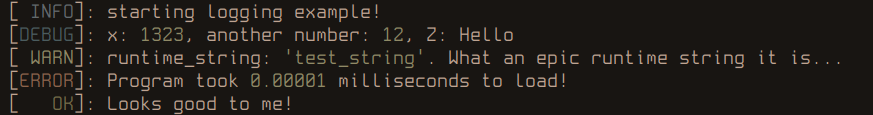

## overview
This is just a test project where I tried to implement my tiny Nim logging module as a Jai metaprogram



Original nim gist: https://gist.github.com/LainLayer/4aa7ce1e47c3486dc6325c20a12958ff

## usage

In Jai:
```jai
info("starting logging example!");
debug("x: ", x, ", another number: ", 12, ", Z: ", Z);
warn("runtime_string: ", runtime_string, ". What an epic runtime string it is...");
error("Program took ", 0.00001, " milliseconds to load!");
ok("Looks good to me!");
```

In Nim:
```nim
info "starting logging example!"
debug "x: ", x, ", another number: ", 12, ", Z: ", Z
warn "runtime_string: ", runtime_string, ". What an epic runtime string it is..."
error "Program took ", 0.00001, " milliseconds to load!"
ok "Looks good to me!"
```

## Notes

Jai version: `Version: beta 0.2.010, built on 4 March 2025.`
